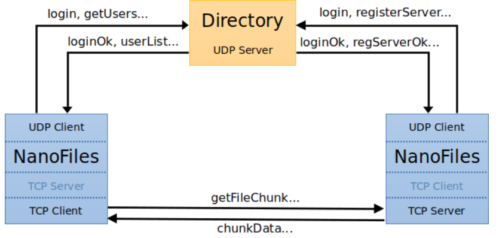
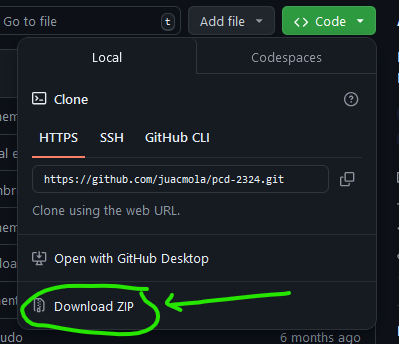

# NanoFiles project

---

##### Disclaimer

The project is intended for educational purpose only.

---

## Contents

  - [Contents](#contents)
  - [Introduction](#introduction)
  - [How to Use the Project](#how-to-use-the-project)
  - [Credits](#credits)
  - [License](#license)

---

## Introduction

This repository contains the NanoFiles Project for the course Redes de Computadores. The course is part of the Degree of Computer Science of the University of Murcia (Universidad de Murcia). This course is being taught in the second semester of the second year of the degree. In this case, our participation in the course was in the academic year 2023/2024.

The project involves the design and programming of communication protocols in Java. The practice consists of creating a file transfer and sharing system that we will call NanoFiles, and which is described below.
The nanoFiles system consists of a directory server (Directory program) and a set of peers (NanoFiles program), which communicate with each other as follows:

- On the one hand, communication between each NanoFiles peer and the directory server is governed by the client-server model. A peer acts as a client of the directory to log in with a user name, query the logged in user names, query the files that can be downloaded from other peers, publish the files it wants to share with the rest of the peers, etc.
- On the other hand, NanoFiles' peer-to-peer communication model is peer-to-peer (P2P).
  - When a peer acts as a client of another peer server, the client can download files available on the server, or part of them.
  - Additionally, a peer can become a file server at the user's request, so that it listens on a specific port waiting for other peers to connect to request the files that the server is sharing.

Here is a picture of how the project works:


To understand all the commands you can use during the program and how they communicate we have created a [`Project Memory`](./ProjectMemory.pdf). Besides it is in Spanish, there are some images that can be really helpful to understand the project. There is also attached an URL link to a video recorded by us where we run the project. The video is also in Spanish.

All the code we have programmed is in [`nanoFilesP2Palumnos`](./nanoFilesP2Palumnos) directory. There are plenty of classes and interfaces that we have created to make the project work. Each class has comments of what it does and how it works.

If you have any questions, please do not hesitate to contact us.

[Back to contents](#contents)

---

## How to Use the Project

In this case, we have used Eclipse IDE to develop the exercises, but you can use another IDE.
To run the project, you can follow the following steps:

1. Download the repository. Click the 'Code' button and download the ZIP file.

1. Go to [`toRun`](./toRun) directory. Here you will find the `Directory` and `NanoFiles` jar files. Write the following commands in the terminal:

    ```bash
    java -jar Directory.jar
    ```

    ```bash
    java -jar NanoFiles.jar
    ```

2. Now, you have a client and the directory running. To try the exchange of files between clients, you can run another `NanoFiles` jar file. You can run as many clients as you want.
3. In [nf-shared](./nf-shared) directory you will find some files that you can share between clients. You can add more files if you want.

**To see clearly this exchange, we recommend you to open the clients in different computers. You will need to use the IPs of each computer in the process, but we can assure you will enjoy the result.**

[Back to contents](#contents)

---

## Credits

The project was developed by the following people:

- [juacmola](https://github.com/juacmola)
- [Effect3](https://github.com/Effect3)

This is part of one of the courses of the Degree of Computer Science of the [Universidad de Murcia](https://www.um.es/web/estudios/grados/informatica) - (Universidad de Murcia).

[Back to contents](#contents)

---

## License

This project has the default copyright license. That means that no one may reproduce, distribute, or create derivative works from our work.

[Back to contents](#contents)

---
###### README.md created with ❤️ by [juacmola](https://github.com/juacmola)
